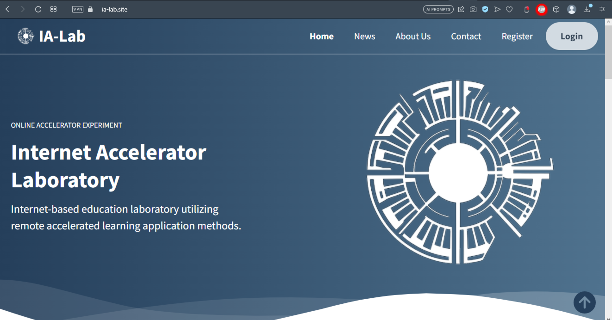
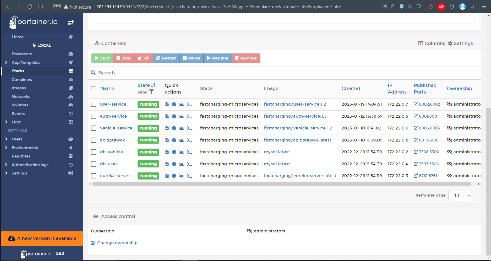
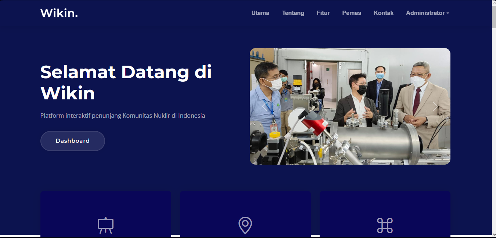
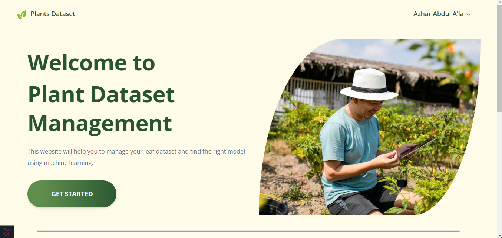

# Azhar's Portfolio

Welcome to my portfolio! This repository contains the code for my personal portfolio website. Here, you can find information about me, my projects, and how to get in touch.

## Table of Contents

- [About Me](#about)
- [Portfolio](#portfolio)
- [Experience](#experience)
- [Certificate](#certificate)
- [Contact](#contact)

## About Me
I graduated with a Bachelor of Applied Engineering in Electronic Instrumentation from the Indonesian Nuclear Technology Polytechnic in 2023, achieving a GPA of 3.57. My skill set includes proficiency in PHP (Laravel), JavaScript, Java (Spring Boot), and MySQL. I have hands-on experience and expertise in developing the Internet Accelerator Laboratory (IA-Lab) website. I am fluent in both Bahasa Indonesia and English, enabling effective communication and collaboration in diverse teams and environments.

## Portfolio

### Internet Accelerator Laboratory (IA-Lab) Website

- **Description**: The IA-Lab website is a final project I successfully designed and developed as a requirement to receive my Bachelor of Applied Engineering degree. It functions to monitor the data acquisition system of linear accelerator machines.
- **Technologies**: PHP (Laravel), JavaScript, MySQL, Tailwind CSS, HTML

### Microservices for Mobile Charging System Applications

- **Description**: This project focuses on developing a mobile application based on microservices for electric vehicle users to find the nearest and suitable Electric Vehicle Charging Stations (EVCS) based on their specific electric vehicle needs.
- **Technologies**: Java (Spring Boot), MySQL, Docker

### Wikin (Website Interaktif Komunitas Nuklir Indonesia)

- **Description**: Wikin is a dynamic platform designed to cultivate a dedicated and knowledgeable nuclear community in Indonesia. It provides an interactive space for stakeholders in the nuclear field to share insights, experiences, and knowledge with the broader public.
- **Technologies**: PHP (Laravel), JavaScript, MySQL, Bootstrap, HTML

### Plant Dataset Management

- **Description**: Plant Dataset Management is a project focused on efficient organization and management of plant-related data. It provides a streamlined approach for storing, accessing, and analyzing plant datasets, aiding researchers and professionals in their work.
- **Technologies**: PHP (Laravel), JavaScript, AWS S3, MySQL, Bootstrap, HTML

## Experience

### Internship at PT Informasi Teknologi Indonesia
- **Position**: IT Developer
- **Duration**: March to May 2022
- **Description**:
  - Developed e-commerce web applications.
  - Collaborated with the team to achieve project goals.

### Internship at Pusat Riset Kecerdasan Artifisial dan Keamanan Siber - BRIN
- **Position**: Backend Developer
- **Duration**: September 2022 to February 2023
- **Description**:
  - Transformed monolithic architecture into a microservices architecture.
  - Created and deployed a microservice within the new architecture.
  - Conducted performance testing to optimize system performance.

## Certificate

### Web Developer
- **Date**: From 15 October 2023
- **Details**: [Web Developer Certificate](https://www.testdome.com/certificates/b0c1e2229faa440491f069f84cbe3448)

### Working Permit of Officer of Radiation Facilities and Radioactive Materials
- **Valid Until**: 14 September 2026
- **Details**: [Certificate Details](SIB PPR Tk. 1 - Azhar.pdf)

### Occupational Safety and Health Technician
- **Valid Until**: 12 September 2027
- **Details**: [Certificate Details](Sertfikat Teknisi K3 - Azhar.pdf)

## Contact
**Email**: [azhar.ala99@gmail.com](mailto:azhar.ala99@gmail.com)

Feel free to explore the repository for more details and feel to reach out to me if you have any inquiries or opportunities!
